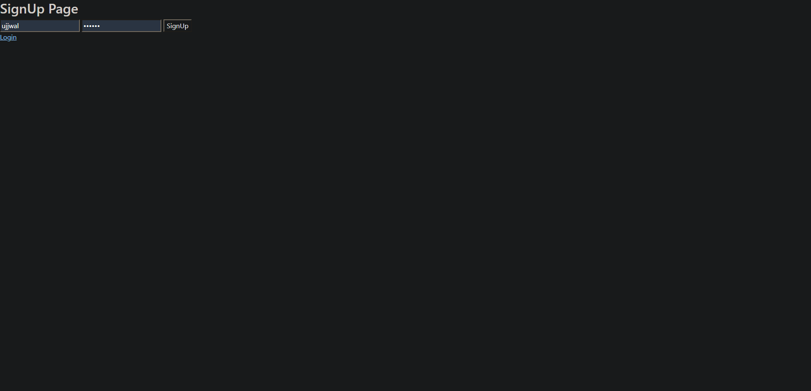
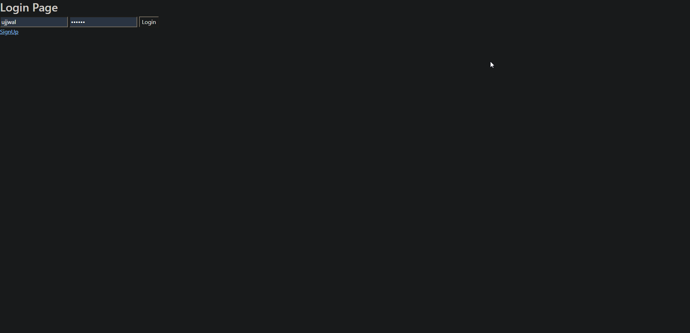
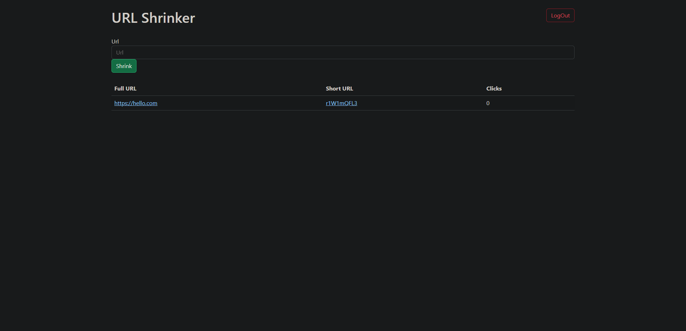

# URL-Shortener

To create a URL shortener using Node.js, you will need to use a few different libraries and technologies. Here are the general steps to create a basic URL shortener:

1. Set up a Node.js project with npm (Node Package Manager)
    - Create a new project folder and navigate to it in the terminal
    - Run **`npm init`** and follow the prompts to create a **`package.json`** file
    - Install the necessary libraries using npm, such as Express and Mongoose
2. Set up a database to store the shortened URLs
    - Install and set up MongoDB, a NoSQL database that can be used with Node.js
    - Use Mongoose to connect to the database and create a URL schema
3. Create an Express server to handle HTTP requests
    - Create a new file, **`server.js`**, and require Express and Mongoose
    - Set up routes for handling requests to the root URL and for redirecting to the original URL
4. Create a function to generate the shortened URL
    - Generate a unique shortcode for each URL, such as using the `shortID` library
    - Store the original URL and shortcode in the database

---

---

### Here are some screenshots of the project:

